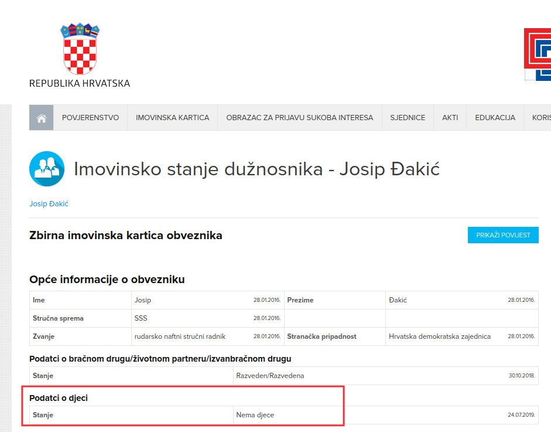

title: Crtica iz imovinske kartice Josipa Đakića
category: politika
tags: Josip Đakić,imovinska kartica
date: 2024-09-12 08:06

Prije dvije godine se povela rasprava o naknadama za odvojeni život na koje
brojni saborski zastupnici imaju pravo. Tada se i doznalo da Josip Đakić prima
naknadu za odvojeni život iako je razveden i ima tri odrasla sina. Jedan od
Đakićevih komentara tada je bio:

> A što, da ih brišem? Kad su nestašni, onda su moji, a kada su pitanja
> obitelji, onda kao da nisu moji…

Čisto kao podjsetnik,
[nestašluk](https://www.telegram.hr/politika-kriminal/ovo-je-nekako-proslo-ispod-radara-i-hdz-ov-josip-dakic-uzima-naknadu-za-odvojeni-zivot-covjek-je-razveden-s-tri-odrasla-sina/)
sinova je (od najmlađeg ka najstarijem):

1. prijetnja smrću policajcima
1. prijetnja novinaru + javno poticanje na nasilje i mržnju
1. pijani nasrtaj autom na osobu.

No, nestašluk na stranu, čini se da Josip Đakić ima sinove kad treba primati
naknadu za odvojen život, ali ih nema kad treba popuniti imovinsku karticu:

Istini za volju, u ranijoj verziji imovinske kartice je naveo da ima djece.
Možda se zbog <q>nestašluka</q> odrekao sinova?

